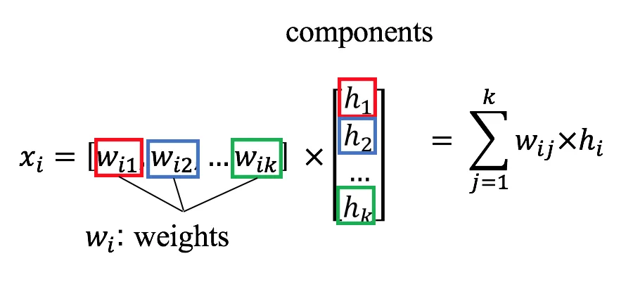

# Movie-Recommender

[Web version](http://llana13.pythonanywhere.com/)

Photo by Felix Mooneeram on Unsplash

This is a movie recommender system that is based on real user ratings on movies [data](https://grouplens.org/datasets/movielens/).

I used an unsupervised learning algorithm, the Non_negative Matrix Factorization (NMF) 

The recommendation accuracy is of course subjective (it depends on each person taste) but a future improvement will be to change the NaN imputation method, the current version uses k-Nearest Neighbor imputation with 10 neighbors and weights="distance" 

[Here](http://llana13.pythonanywhere.com/) you can see a web version running in pythonanywhere using Flask.

The recommender takes three favorite movies from the user as input and outputs as many recommendations as the user wish.

